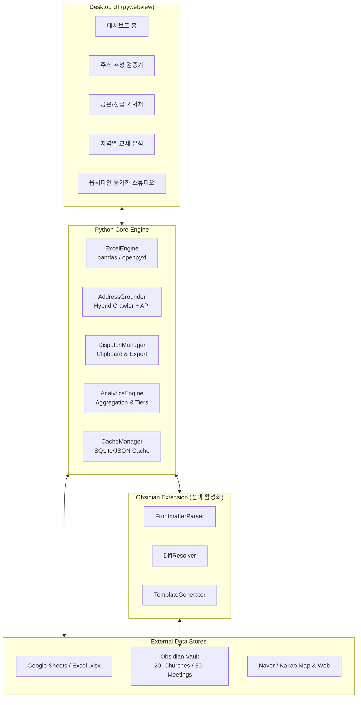

# [Design] church-partner-hub: 교회 파트너십 허브 및 주소 Grounding 시스템

> **문서 상태:** 승인 완료 (Approved)  
> **최초 작성일:** 2026-09-09  
> **프로젝트 위치:** `C:\Users\20260602\Documents\github\church-partner-hub`  
> **관련 볼트:** `C:\Users\20260602\Documents\github\Obsidian`

---

## 1. 배경 및 설계 목표 (Context & Goals)

### 1.1 해결하고자 하는 문제 (Core Problems)
1. **주소 불확실성 및 발송 오류 리스크**:
   - `[담임목사성함, 교회명, 지역]`만 있고 주소가 누락된 교회가 다수 존재.
   - 회사에서 선물이나 공문 발송을 요청할 때마다 수작업으로 지도를 검색하고 확인해야 하는 비효율 발생.
   - 동명 교회/동명이인 목회자로 인해 오배송될 경우 대외 신뢰도에 치명적이므로, **100% 자동화가 아닌 신뢰도 높은 근거(Grounding)를 사람이 직접 확인하고 승인하는 체계**가 필수.
2. **이원화된 데이터 관리의 혼선**:
   - **엑셀 마스터시트 (구글 스프레드시트 기반)**: 한눈에 파악하는 고수준 관리(제안사업 현황, 후속조치, 관리등급, 발송 이력).
   - **옵시디언(Obsidian)**: 심층적인 교회 프로필(`20. Churches`), 목회자 네트워크(`10. People`), 상세 미팅/접촉 히스토리(`50. Meetings`).
   - 두 도구 간 데이터 불일치가 누적되면 업무 혼선이 발생하므로 상호 보완 및 차이점 대조(Diff)가 필요.
3. **팀/본부 범용성과 개인 생산성의 조화 (이원화 운영 모드)**:
   - **마스터 관리 모드 (내부 기획자용)**: 17개 고유 헤더 컬럼을 유지하며 제안사업, 후속조치, 교세, 옵시디언 동기화까지 풀사이클로 관리.
   - **간편 주소록 모드 (외부/타 부서 일반 사용자용)**: 외부 사용자는 17개 컬럼이 필요 없음. 단순히 `[담임목사, 지역, 교회명]` 3개만 입력하면 정제된 **주소록과 공식 홈페이지 URL**을 자동 생성하여 간이 엑셀/CSV로 제공.
4. **홈페이지 검증의 주소 종속성 (Cascading Uncertainty)**:
   - 교회 홈페이지는 사이트 내 '오시는 길' 또는 푸터의 실제 도로명 주소를 대조하여 검증함.
   - **1차 교회 주소가 불확실(Low / 미확정)하면 홈페이지 역시 당연히 불확실로 종속 처리**하여 오정보 오배송을 방지.
5. **배포 및 사용 편의성**:
   - 윈도우 환경에서 파이썬 설치나 터미널 조작 없이 **단일 포터블 `.exe` 더블클릭**으로 즉시 구동되는 데스크톱 앱이어야 함.

---

## 2. 시스템 아키텍처 (System Architecture)

### 2.1 주요 모듈 구성
- **UI 셸**: `pywebview` 기반 경량 데스크톱 네이티브 창 + TailwindCSS/HTML5/Vanilla JS.
- **`ExcelEngine`**: 원본 엑셀 서식/수식 100% 보존 마스터 모드 및 3입력/7출력 간편 주소록 모드 전용 입출력 엔진.
- **`AddressGrounder`**: 도로명 주소 탐색 및 신뢰도 산출 하이브리드 검색기.
- **`HomepageGrounder`**: 1차 주소 기반 홈페이지 탐색 및 주소 일치 교차 검증 (Cascading Uncertainty 적용).
- **`ObsidianBridge`**: 옵시디언 마크다운 Frontmatter(YAML) 파싱, 템플릿 기반 노트 생성, Diff 대조 및 `obsidian://` 딥링크 생성.
- **`DispatchManager`**: 공문/선물 발송용 규격화된 텍스트 및 TSV/엑셀 원클릭 복사기.
- **`AnalyticsEngine`**: 지역별, 교단별, 성도 수 5단계 규모별(Tier) 피벗 통계 집계.

### 2.2 핵심 개발 원칙 (SOLID, YAGNI, 실용적 확장성)
- **S.O.L.I.D 원칙**: 각 엔진의 단일 책임(SRP)과 인터페이스 기반 결합도 최소화(DIP/ISP)로 단위 테스트 용이성 및 모듈 격리 보장.
- **YAGNI 원칙**: "지금 당장 필요한 기능만 고려하여 작성". 미사용 매개변수나 가상의 플러그인 아키텍처 등 과도한 엔지니어링 배제.
- **실용적 확장성**: 2~3회 수준의 요구사항 변경(컬럼 추가/순서 변경, 파서 셀렉터 수정, 임계값 조정 등)에 무리 없이 대응할 수 있는 수준의 담백한 유연성만 확보.

---

## 3. 데이터 스키마 (Data Schema)

### 3.1 마스터시트 17개 기본 컬럼 명세
사용자가 현재 관리 중인 구글 스프레드시트 양식을 100% 반영:

| 번호 | 컬럼명 | 용도 및 설명 | 옵시디언 매핑 키 |
|:---:|:---|:---|:---|
| 1 | **지역** | 교회 소재 지역 (예: 광주, 동대문, 하남 등) | `region` |
| 2 | **구분** | 교회 분류 (이사교회, 타겟교회, 후원교회 등) | `classification` |
| 3 | **교회명** | 교회의 정식 명칭 | 파일명 (`{교회명}.md`) |
| 4 | **담임목사** | 담임목회자 성함 | `pastor` (예: `[[홍길동 목사]]`) |
| 5 | **교회 주소** | 도로명 주소 (주소 추정기의 주 타겟) | `address` |
| 6 | **교단** | 예장통합, 예장합동, 백석, 기성, 기하성 등 | `denomination` |
| 7 | **성도 수(명)** | 출석 성도 수 또는 교세 규모 | `congregation_size` |
| 8 | **관리등급** | 전략적 중요도 (A, B, C) | `tier` |
| 9 | **온도감** | 파트너십 친밀도 / 협력 적극성 | `temperature` |
| 10 | **관리유형** | 관리 방식 및 접근 성향 | `management_type` |
| 11 | **1차 제안사업** | 기아대책 제안 사업명 1차 | `active_campaigns` |
| 12 | **1차 제안일** | 제안 날짜 (YYYY-MM-DD) | 미팅 일지 `date` |
| 13 | **현재 제안단계** | 제안완료, 후속 필요, 검토중, 확정 등 | 미팅 일지 `status` |
| 14 | **후속 제안사업** | 차기 협력 논의 사업 | `active_campaigns` |
| 15 | **다음 액션** | 다음 실행 과제 (Action Item) | 미팅 일지 `next_action` |
| 16 | **다음 접촉일** | 차기 연락 예정일 (YYYY-MM-DD) | 미팅 일지 `next_contact_date` |
| 17 | **비고** | 기타 특이사항 및 메모 | 본문 메모 |

### 3.2 시스템 부가 컬럼 (마스터 모드 자동 관리)
- `우편번호`: 5자리 국가기초구역번호 (공문/택배 필수)
- `홈페이지`: 공식 웹사이트 URL
- `주소검증상태`: `승인완료`, `수기입력`, `미검증`
- `홈페이지검증상태`: `확인완료`, `불확실(주소불확실종속)`, `미발견`, `미검증`
- `Obsidian링크`: `obsidian://open?vault=Obsidian&file=20.%20Churches%2F{교회명}`

### 3.3 간편 주소록 스키마 (외부/일반 사용자 모드)
외부 사용자 또는 타 부서 실무자는 17개 고유 관리 항목을 거치지 않고 단순 양식으로 작업:
- **필수 입력 헤더 (3개)**: `[담임목사, 지역, 교회명]`
- **최종 산출 헤더 (7개 정제 주소록)**:
  `[교회명, 담임목사, 지역, 도로명 주소, 우편번호, 교회 홈페이지, 검증 상태]`

---

## 4. 핵심 기능 상세 설계 (Core Workflows)

### 4.1 2단계 주소·홈페이지 연계 Grounding & 종속적 불확실성(Cascading Uncertainty)
1. **1단계: 도로명 주소 추정 및 신뢰도 산출**:
   - 대상 식별: 시트에서 `교회 주소`가 비어있거나 검증이 필요한 행 추출.
   - 탐색: 네이버/카카오 지도 검색 (`{지역} {교회명}`) + 스니펫에서 `{담임목사}` 및 `{교단}` 일치 확인.
   - 신뢰도: High (90%+), Medium (70~89%), Low (<70%).
2. **2단계: 주소 기반 홈페이지 탐색 및 교차 검증**:
   - 검색된 공식 웹사이트 내 '오시는 길' 또는 푸터 주소 수집.
   - **종속적 불확실성 (Cascading Uncertainty) 규칙**:
     - **원칙**: 홈페이지의 진위는 실제 주소와의 일치 여부로 검증되므로, **1차 대상인 교회 주소가 불확실(Low / 미확정)할 경우, 해당 주소 기반으로 매칭된 홈페이지 역시 당연히 '불확실(Uncertain / Low)'로 종속 강등**된다.
     - 주소 미확정 상태에서는 어떠한 웹사이트도 자동으로 '확인완료' 처리하지 않음.
3. **대화형 검증 UI**:
   - 카드 형태로 후보 주소, 우편번호, 포털 지도 링크 제공.
   - 홈페이지 후보 URL 및 "주소 불확실에 따른 홈페이지 검증 보류" 상태 배지 제공.
   - 사용자가 `[승인]`, `[주소/URL 직접 수정]`, `[보류]` 조작 지원. 사용자가 주소를 수기 수정/확정 시 홈페이지 신뢰도를 즉시 재평가.

### 4.2 옵시디언 ↔ 엑셀 스마트 동기화 모드
- **모드 활성화**: 설정에서 `옵시디언 볼트 경로`와 `엑셀 마스터시트 경로`를 지정하면 메뉴 활성화.
- **Diff 감지 및 상호 해결**:
  - 양쪽의 정보(주소, 담임목사, 교단, 제안사업 상태 등)가 다를 경우 카드 형태로 차이점을 제시하고 사용자가 "어느 쪽이 맞는지" 선택.
- **상호 보완 (Gap-fill)**:
  - 엑셀에만 있는 신규 교회 ➡️ `20. Churches/{교회명}.md`를 [Template - Church (교회_조직).md](file:///C:/Users/20260602/Documents/github/Obsidian/90.%20Templates/Template%20-%20Church%20%28%EA%B5%90%ED%9A%8C_%EC%A1%B0%EC%A7%81%29.md) 양식으로 자동 생성.
  - 옵시디언에만 있는 신규 교회 ➡️ 엑셀 마스터시트에 신규 행으로 추가 제안.

### 4.3 공문/선물 발송 퀵서처 (Quick Dispatcher)
- 교회명 초성 검색(예: `ㄱㅈㅅ` ➡️ 광주겨자씨교회) 및 목회자명 즉시 검색.
- 원클릭 클립보드 복사:
  - **공문용**: `수신: {교회명} ({담임목사} 목사 귀하) / 주소: ({우편번호}) {교회 주소}`
  - **택배/선물용**: `{교회명} / {담임목사} / {교회 주소} / {우편번호} / {대표전화}`
  - **스프레드시트용 (TSV)**: 탭 구분 텍스트로 복사되어 엑셀에 바로 `Ctrl+V`.

### 4.4 지역별 교세 분석 (Regional Church Analytics)
사용자가 요구한 세부 분석 지표(지역별 교단 분포, 교회 수, 5단계 규모별 개수 및 분포도)를 정밀하게 반영:

1. **지역별 기본 현황 집계**:
   - 지역별 등록 교회 수, 총 성도 수, 평균 성도 수
2. **지역별 교단(Denomination) 분포 분석**:
   - 각 지역 내 교단별 교회 수 및 비율 (예: 광주 ➡️ 예장합동 5개(45%), 예장통합 3개(27%), 백석 2개(18%), 기타 1개)
   - 지역별 주요 교단 점유율 비교 뷰
3. **5단계 교회 규모(성도 수) 정밀 세그먼트**:
   - 🟢 **소형 교회**: ~100명 미만
   - 🔵 **중형 교회**: 100명 ~ 500명 미만
   - 🟡 **중대형 교회**: 500명 ~ 1,000명 미만
   - 🟠 **대형 교회**: 1,000명 ~ 3,000명 미만
   - 🔴 **초대형 교회**: 3,000명 이상
   - *(성도 수 미기재 교회는 '규모 미입력' 카테고리로 별도 분류하여 누락 관리)*
4. **규모별 교회 수 및 분포도(Distribution)**:
   - 지역별 각 규모 구간별 교회 수(개) 및 분포 비율(%) 자동 산출
   - 지역별 규모 분포 누적 바 차트(Stacked Bar Chart) 및 전체 규모 파이/도넛 차트
   - 교단 × 규모 교차 분석 테이블 (Cross-tabulation)
5. **인터랙티브 드릴다운 (Drill-Down View)**:
   - 대시보드에서 특정 지역(예: '광주') 또는 특정 규모(예: '대형 1,000~'), 특정 교단 클릭 시 해당 조건의 교회 상세 목록(교회명, 담임목사, 성도 수, 교단, 관리등급, 주소)을 하단에 즉시 필터링하여 표시.

---

## 5. 블라인드 리뷰 및 리스크 대응 (Blind Review & Mitigation)

| 구분 | 위험 요소 (Risk) | 등급 | 해결 방안 (Mitigation) |
|:---:|:---|:---:|:---|
| **파일 무결성** | 엑셀 파일이 열려 있을 때 저장 시 충돌 (`PermissionError`) | **Tier 1** | 임시 파일(`~$temp`)에 먼저 쓰고 원자적 교체(Atomic replace) 적용. 열려 있을 시 "파일을 닫아주세요" 안내 팝업. |
| **요청 차단** | 대량 검색 시 네이버/카카오 웹 요청 IP 차단 위험 | **Tier 1** | 로컬 캐시(`address_cache.json`) 도입 및 요청 간 1.0~1.5초 랜덤 지연(Jitter) 적용. |
| **마크다운 파괴** | 옵시디언 노트 파싱 시 위키링크(`[[...]]`)나 YAML 파괴 | **Tier 1** | 엄격한 정규식 기반 Frontmatter 추출 및 수정 전 `.bak` 자동 백업 보장. |
| **포터블 빌드** | PyInstaller 빌드 파일 용량 비대화 | Tier 2 | 가상환경 분리 및 불필요한 라이브러리(`torch`, `matplotlib` 등) 철저 배제. |
| **API 키 노출** | 팀원 배포 시 개인 API 키 노출 위험 | Tier 2 | 기본 모드는 키 없이 동작, 키 등록은 로컬 `settings.json`에 암호화 보관. |

---

## 6. 마일스톤 및 향후 확장 계획

1. **Phase 1 (MVP)**:
   - 프로젝트 뼈대 및 `pywebview` UI 구성
   - 엑셀 로더 및 하이브리드 주소 추정기 + 대화형 검증 UI 구현
   - 공문/선물 퀵서처 및 지역별 교세 통계 구현
2. **Phase 2 (옵시디언 동기화 모드)**:
   - 옵시디언 볼트 연동, Diff 대조 및 템플릿 자동 생성 기능 구현
3. **Phase 3 (배포 및 최적화)**:
   - PyInstaller 단일 포터블 `.exe` 빌드 파이프라인 수립
4. **Phase 4 (추후 확장)**:
   - 교회 공식 홈페이지 URL 추정
   - 교회 규모(성도 수) 웹 탐색 추정 보조
